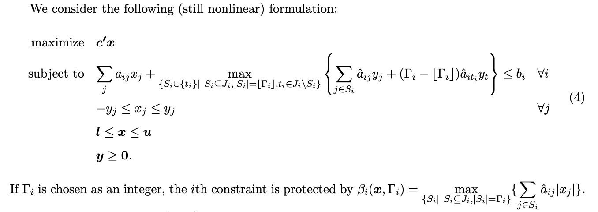

# Stochastic Optimization

- [Installation](#installation)
- [How to use the project](#how-to-use-the-project)
   - [News vendor](#news-vendor)
   - [Robust knapsack](#robust-knapsack)
- [References](#some-references-and-personal-reading-notes)
   - [Stochastic Optimization](#stochastic-optimization-1)
   - [Robust optimization](#robust-optimization)

## Installation

### Python environment

python 3.10.0 is used to run this project. Dependencies and packaging are handled with Poetry (1.1.11).

You might need to run some of the following commands to install the project:
```bash
# Install poetry
curl -sSL https://raw.githubusercontent.com/python-poetry/poetry/master/get-poetry.py | POETRY_VERSION=1.1.11 python -

# Update poetry version
poetry self update 1.1.11

# Enable poetry to install the venv at the root of the project dir
poetry config virtualenvs.in-project true

# Check which version of python is used
poetry env info

# Change python version
poetry env use /path/to/python3.10.0
```

Install the packages dependencies:
```bash
poetry install
```

You can run any python script locally with
- `poetry run python my_script.py`: for any python script
- `poetry run sto my_command`: for any command registered in `stochastic_optimization/__main__.py`


### pre-commit hooks

[pre-commit](https://pre-commit.com/) is used to manage git hooks. You need to install the hooks into your local repo:

```shell
poetry run pre-commit install
```

### Gurobi
The [Gurobi](https://www.gurobi.com/) solver is used to solve our optimization problems here. Gurobi is a paid solver, and we're interacting with it via the [`gurobipy`](https://pypi.org/project/gurobipy/) package that includes a **trial** license (limited to small problem size). This is enough for this sandbox project.

If you're willing to fork this project and play with larger problem instances you might need to ask/pay for a proper license, or rewrite the code to use a solver-agnostic package (e.g. [Pyomo](http://www.pyomo.org/)) with an open-source solver (e.g. [GLPK](https://www.gnu.org/software/glpk/)).

> The error message "Model too large for size-limited Gurobi license" or "Model too large for restricted Gurobi license" is displayed when Gurobi uses a restricted, size-limited license, and the model size exceeds these limits, i.e., 2000 variables, 2000 linear constraints, and 200 variables if quadratic terms are present.


## How to use the project

You can use the cli to run the code:
```shell
poetry run sto --help
```

### News vendor

#### How to run the code
We implemented several versions of the news vendor problem with different objectives / resolution methods:
- `max E[profits]` with analytical resolution
- `max E[profits]` with LP resolution
- `min VaR_a[-profits]` with LP resolution
- `min CVaR_a[-profits]` with LP resolution

The code is available under `stochastic_optimization/news_vendor/…`

You can run the following command to launch the news vendor problem
```shell
❯ poetry run sto news-vendor --help

Usage: sto news-vendor [OPTIONS]

Options:
  --problem-instance [expected_profit_analytic|expected_profit_lp|VaR|CVaR]
                                  NewsVendor problem instance to solve
  --demand-distribution [bernoulli|betabinom|binom|boltzmann|dlaplace|geom|hypergeom|logser|nbinom|nchypergeom_fisher|nchypergeom_wallenius|nhypergeom|planck|poisson|randint|skellam|yulesimon|zipf|zipfian]
                                  scipy.stats distribution to chose for the
                                  demand - please make sure it has a limited
                                  spread of values (to limit instance size).
                                  You can pass distribution parameters as
                                  additional (unchecked) options - see README
                                  for examples
  --unit-cost FLOAT               unit cost of a newspaper
  --unit-sales-price FLOAT        unit sales price of a newspaper
  --alpha FLOAT                   Percentile (between 0.0 and 1.0) used for
                                  VaR and CVaR objectives
  --sample-size INTEGER           Sample size for plotting the distribution
                                  graphs
  --help                          Show this message and exit.
```

All `scipy` [discrete probability distributions](https://docs.scipy.org/doc/scipy/tutorial/stats/discrete.html) are supported by the module (provided its spread is not too large because of the Gurobi free license issue). To specify the distribution parameters, just precise the options in the CLI call (variable names need to be coherent with `scipy`'s ones).

For example to have `demand ~ binom(n=10, p=0.5)`
```shell
poetry run sto news-vendor \
   --problem-instance expected_profit_lp \
   --demand-distribution binom \
   --unit-cost 1.0 \
   --unit-sales-price 2.0 \
   --n 10 \
   --p 0.5
```

#### Results & discussion
We will play around a low-margin example (where buying cost = 1€ and sales price = 1.1€), and with a `Poisson(mu=100)` random variable.

```shell
poetry run sto news-vendor \
   --problem-instance <several-problems>\
   --alpha <several-alphas>\
   --demand-distribution poisson \
   --unit-cost 1.0 \
   --unit-sales-price 1.1 \
   --mu 100
```

The distribution for demand is the following with a "large" spread between 70 & 140 units:


The overall idea behind stochastic optimization is how to be able to shift distribution of your economic objective: What is the maximum profit you will get? How likely are bad (and very bad) events to happen? etc.

##### Maximizing expected profit
Good sanity check: the LP implementation and the analytic solution to the problem yield to the same results and same distribution of profits.


##### Minimizing CVaR-a
We see that minimizing CVaR tends to collapse the profits (and losses) distribution into a smaller spread: we hedge against very bad outcomes, at the price of reducing the economic profit in case of very good events (i.e. high volume of next-day demand).

- CVaR-0.85


- CVaR-0.95


- Expected profit (for comparison)


##### Minimizing VaR-a

We see that minimizing VaR tends to push the profits (and losses) distribution to the right-hand-side and collapse into a smaller spread. We hedge against very bad outcomes, at the price of reducing the economic profit in case of very good events (i.e. high volume of next-day demand). What is a bit surprising here is that it also improves the expected profit (but decreases the maximal profit in case of very good events - _which is an expected behaviour_).

- VaR-0.85


- VaR-0.95


- Expected profit (for comparison)


NOTE: ⚠️ Results do not always seem consistent accross runs. Implementation to be investigated (but it seems consistent with other implementations found - e.g. ["Optimization of Value-at-Risk: Computational Aspects of MIP
Formulations"](https://www.researchgate.net/profile/Konstantin-Pavlikov/publication/309550219_Optimization_of_Value-at-Risk_Computational_Aspects_of_MIP_Formulations/links/5b1e369645851587f29f819f/Optimization-of-Value-at-Risk-Computational-Aspects-of-MIP-Formulations.pdf))

### Robust knapsack

#### How to run the code

The code is available under `stochastic_optimization/robust_knapsack/…`

You can run the following command to launch the news vendor problem
```shell
❯ poetry run sto robust-knapsack --help

Usage: sto robust-knapsack [OPTIONS]

Options:
  -i, --item TEXT               Items to be selected in the knapsack problem.
                                Expected format is a string of floats
                                separated by a ',' with numbers in the
                                following order: "value, min_weight,
                                max_weight" e.g. "12, 3, 7"
  --uncertainty-budget INTEGER  Uncertainty budget to robust resolution
  --capacity INTEGER            Total capacity budget of the knapsack
  --help                        Show this message and exit.

```

#### Results & discussion

We implemented the example from [Optimisation robuste: faire face au pire cas](http://www.roadef.org/journee_aquitaine/pdf/IMB_RO.pdf) (see slide 18) and found the same results, which is a reassuring unit-test. The complexity of this implementation was to properly formulate the "worst case scenario" constraint, which required to pre-compute "many" scenarios and introduce one constraint per scenario.

_Ignoring randomness:_
```shell
poetry run sto robust-knapsack \
   --uncertainty-budget 0 \
   --capacity 7 \
   --item "12, 3, 7" \
   --item "6, 2, 3" \
   --item "5, 2, 3" \
   --item "5, 1, 2"

Chosen items: [1.0, 1.0, 1.0, 0.0]
Objective at optimality: 23.0
```


_Basic worst case scenario:_
```shell
poetry run sto robust-knapsack \
   --uncertainty-budget 4 \
   --capacity 7 \
   --item "12, 3, 7" \
   --item "6, 2, 3" \
   --item "5, 2, 3" \
   --item "5, 1, 2"

Chosen items: [1.0, 0.0, -0.0, 0.0]
Objective at optimality: 12.0
```

_Robust optimization with uncertainty budget 2:_
```shell
poetry run sto robust-knapsack \
   --uncertainty-budget 2 \
   --capacity 7 \
   --item "12, 3, 7" \
   --item "6, 2, 3" \
   --item "5, 2, 3" \
   --item "5, 1, 2"

Chosen items: [-0.0, 1.0, 1.0, 1.0]
Objective at optimality: 16.0
```

## Some references (and personal reading notes)

### Stochastic Optimization

#### [Solving Simple Stochastic Optimization Problems with Gurobi](https://www.youtube.com/watch?v=Jb4a8T5qyVQ)

[](https://www.youtube.com/watch?v=Jb4a8T5qyVQ)

A nice introduction to stochastic problems, using a pratical example with the newsvendor problem. Main focus is on the choice of an objective function (expected loss, value at risk, conditional value at risk)

**Reading notes:**

> - Simple algorithms rely on sampling: quick practical convergence in many cases. Relies on old deterministic techniques, but problem size can increase a lot
> - Focus on the news vendor problem: Decide how much inventory to buy today, sell tomorrow depending on (stochastic) demand.
> - Description of 2-stage problems:
>   - First stage decision: make a decision before the stochasticity is revealed to you. Cannot depend on the realization of the random variable.
>   - Second stage variable: can depend on the random variable (e.g. how much quantity you're going to scrap tomorrow).
> - How do we valuate uncertain outcome (maybe expected value, what about risk?).
> - Maximizing the expectation for continuous random variables leads to infinite dimension (how do I integrate?). For discrete variable, it's just a very large LP: `E[x] = ∑ p_i * x_i`
> - Other objective functions:
>   - Maybe we want to limit exposure to bad cases. What about maximizing worst case return? It's still an LP, but can be too conservative.
>   - Maybe worth optimizing the 25th worst value. It is called the VAR-75% (value at risk). It becomes a chance constraint problem (*it becomes a "bad" MIP, need to track every-scenario - not sure to have understood why*)
>   - Conditional value at risk = the average of the tail distribution (not only the exact VAR-a point): `CVaR_a[Ω] = E[Ω | Ω ≥ VaR_a[Ω]]`
> - formulation of the value at risk:
>   - `CVaR_a[Ω] = min t + E[|Ω-t|+] / (1 - a)`
>   - This allows for simple optimization and constraints
> - You can do custom CVaR objectives: (50% of CVaR-75% + 50% expected)
> - Choosing constraints / objectives can help shape the resulting distribution.
> - With continuous variables: sampling is enough under most general conditions. "Sample average approximation method". `Z(x*) ≥ Zp ≥ E[Zp^]`


#### [Stochastic and dynamic programming - ENSTA Paris Saclay](http://cermics.enpc.fr/~leclerev/OptimizationSaclay.html)

University course covering both stochastic programming and dynamic progamming. I only focused on the former. Completes well the Gurobi webinar & has some practical exercises.

**Reading notes:**

> - There is a closed form result for the news-vendor problem
> - Carefuly think of your objective: in some cases the expectation is not really representative of your risk attitude
> - Stochastic constraints: `g(u,Ω) < 0, P−as`
>  - Deterministic version: `g(u,Ω) < 0 for all Ω` can be extremely conservative, and even often without any admissible solutions. (e.g. if `Ω` is unbouded -e.g. Gaussian- no control `u` is admissible).
>  - A few possible options:
>    - Service-level like constraint: `E[g(u,Ω)] < 0`
>    - Chance-constraint `P(g(u, Ω) < 0) ≥ 1 - eps` ( butdoesn't tell you what happens when the constraint is not satisfied)
>    - `CVaR-a[g(u,Ω)] < 0`

#### [Stochastic optimization and learning - a unified framework](https://castlelab.princeton.edu/wp-content/uploads/2018/01/Powell_StochOptandLearningJan072018.pdf)

Very complete textbook on stochastic optimization with various flavours (stochastic programming, optimal control, dynamic programming, online learning, multiarm bandits, etc.). Didn't have time to properly dig into it, but I'll keep it in mind for future reference.

## Robust optimization

#### [Optimisation robuste: faire face au pire cas](http://www.roadef.org/journee_aquitaine/pdf/IMB_RO.pdf)

Quite different from the other ones. Focus on robust optimization: optimizing under the worst-case scenario (thus removing the notion of stochasticity).

**Reading notes:**

> - Difference stochastic vs. robust optimization
>   - Stochastic optimization: Experience run several times, no major risk in case of "bad" realization of the random effect.
>   - Robust optimization: Immunity against the worst uncertain events.
> - Worst-case basic approach (too simplistic): in practice you protect yourself against impossible events… to the detriment of the economic quality of the solution.
> - Uncertainty budgeting approach: improvement of the worst-case basic approach
>   - parameters can vary within a range.
>   - at most `T` parameters will vary (`T` = "uncertainty budget")
>   - look-up for solutions with optimal cost, that are still feasible under this set of deviations.
> - Example of the robust knapsack

#### [The Price of Robustness](https://www.robustopt.com/references/Price%20of%20Robustness.pdf)

A reference article on robust optimization. Solves the robust knapsack problem as an application problem. It introduces a new (non-linear) formulation of robust problems and reformulates it as a linear problem.
We used this formulation in our implementation of the robust knapsack

Non-linear formulation



Linear formulation


#### [Exact solution of the robust knapsack problem](https://www.sciencedirect.com/science/article/pii/S0305054813001342)

Focus on the robust knapsack problem (implemented in this repo). I initially though this would be an easy toy problem to implement. It turned out to be a more complex min-max problem (as it is quite tricky to efficiently formulate a not-too-optimistic "worst case scenario" constraint). There are several algorithms to solve this problem - the paper focuses on DP and benchmarks against others.

Additional reading [Knapsack problem and variants](https://www.euro-online.org/websites/esicup/wp-content/uploads/sites/12/2019/05/esicup2019-michelemonaci.pdf) - esp. slides 17-18 for benchmarks of methods

#### [RSOME](https://xiongpengnus.github.io/rsome/)

Not exactly readings per se, but a `python` package to implement robust optimization problems.
